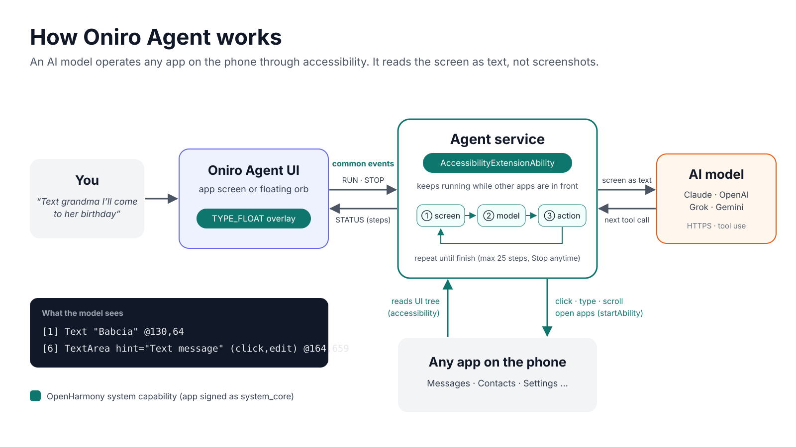

# Architecture

One ArkTS app, signed as a system app. You give it a task in plain language, and an AI model completes it by operating the phone's other apps.



## Components

Paths are relative to `entry/src/main/ets/`.

| Component | Where | Role |
|---|---|---|
| Agent service | `a11y/AgentA11y.ets` | `AccessibilityExtensionAbility`. Runs the agent loop and keeps running while other apps are in front. |
| Device access | `a11y/DeviceExecutor.ets`, `a11y/ScreenReader.ets` | Reads the UI tree of the active window. Taps, types, scrolls, presses Back/Home, opens apps (`launcherBundleManager` lists them, `startAbility` opens them). Typing selects existing text before inserting: ArkUI's `SET_TEXT` inserts at the cursor on this image, so prefilled fields would otherwise concatenate the old and new values. |
| Agent loop | `agent/AgentLoop.ets` | Asks the model, validates its tool calls, runs them, sends back the new screen. |
| Screen as text | `agent/ScreenText.ets` | Turns the UI tree into numbered lines the model can act on. |
| Tools and prompt | `agent/Tools.ets`, `agent/Prompt.ets` | 10 tools (`list_apps`, `launch_app`, `read_screen`, `click`, `type_text`, `scroll`, `press_key`, `set_alarm`, `read_skill`, `finish`), their validation, and the system prompt. |
| User skills | `agent/Skills.ets`, `pages/Skills.ets`, `pages/SkillEdit.ets` | User-written instructions the model can read on demand. See [User skills](#user-skills). |
| AI providers | `agent/Anthropic.ets`, `OpenAiCompat.ets`, `Gemini.ets`, `Http.ets`, `Providers.ets` | One client per API format, shared HTTP with retries and error mapping. |
| App UI | `pages/Index.ets`, `pages/Settings.ets`, `common/AgentClient.ets` | Task input, live step list, settings. Starts and stops tasks; it does not run them. |
| Overlay | `overlay/OverlayService.ets`, `overlay/OverlayController.ets` | `ServiceExtensionAbility` with `TYPE_FLOAT` windows. The orb is the app minimized (like a chat head): shown while the app is in the background and no task runs; tap opens the app. While a task runs, a status pill (current step, latest thought, Stop) and an edge glow show instead. |
| Messaging | `common/Bridge.ets` | Common events between UI, overlay and agent service. |

Readable text and editable fields retain up to 4000 characters so long notes keep their dates and instructions; control labels remain capped at 80 characters.

## One task, step by step

1. The UI publishes `RUN` with the task, provider, model and effort.
2. The agent service lists the launchable apps and sends the task and the app list to the model.
3. The model replies with tool calls. Each call is validated before anything happens on the phone.
4. The service runs the call through accessibility, waits for the UI to settle (1.2 s), reads the screen again and returns it as the tool result.
5. Each step is published as `STATUS`, and the UI and pill show it as a plain sentence ("Open Messages", `Tap "Send"`).
6. Steps 3–5 repeat until the model calls `finish`, the user presses Stop, or a limit is hit.

What the model sees after each action:

```
App: com.ohos.mms
[1] Text "New message" @130,64
[3] TextArea (click,edit) @180,120
[6] TextArea hint="Text message" (click,edit) @164,659
[7] Image (click) @332,658
```

## Design decisions

**The loop runs in the accessibility extension, not in the UI.**
Once the agent opens Messages, our UI goes to the background and may be frozen. The accessibility extension is a separate process that the system keeps alive. The UI is just a remote control.

**The screen is sent as text, not screenshots.**
The accessibility tree already has every element's type, text, state and possible actions. As text, any tool-use model can read it without vision, and it refers to elements by index rather than by pixel position. Plain text rows are folded into the tappable element they belong to, so a settings row reads `[4] Flex "WLAN · Off" (click)` instead of three separate lines. The cost: icon-only buttons without labels appear as `Image (click) @x,y`, and the model has to guess them from their position.

**No vendor SDKs.**
None exist for ArkTS, and we want no runtime dependencies. The loop keeps one conversation format internally (text, tool_use, tool_result blocks). Each client translates it to its API: Anthropic Messages, OpenAI-compatible Chat Completions (OpenAI, xAI), and Gemini generateContent. To add a provider, you add one translator. Nothing else changes.

**The history is append-only.**
Thinking blocks and Gemini thought signatures have to come back unchanged, and an unchanged prefix keeps the provider's prompt cache warm. The cost: tokens grow with each step, and the 25-call cap bounds that growth.

**Common events, restricted to our bundle.**
UI, overlay and agent service run in separate processes. Events are published with our `bundleName` and only accepted from our bundle (`publisherBundleName`), so other apps can neither start tasks nor read the log. The one exception is the stock navigation bar (`com.ohos.systemui`), which may open the overlay, for a future long-press Home.

**Overlay windows that only show status are not focusable.**
The pill and the glow never take focus, so the app the agent is operating stays the active window and its UI tree is the one being read.

**System app, signed with the public OpenHarmony test CA.**
Listing apps (`GET_BUNDLE_INFO_PRIVILEGED`), starting them from the background, turning on accessibility from code (`WRITE_ACCESSIBILITY_CONFIG`) and system float windows all need system permissions. Stock OpenHarmony trusts the public test certificates, so `scripts/sign.ps1` produces a package that installs with plain `hdc install`, without changing the OS. The service extension also needs `AllowAppUsePrivilegeExtension` in the profile (`signing/profile-template.json`).

## User skills

`pages/Skills` and `pages/SkillEdit` manage user-written instructions. `agent/Skills.ets` validates records and tolerantly parses the JSON array stored under `skills` in the existing `settings` Preferences. The accessibility service drops the Preferences cache at task start and snapshots enabled skills. Providers receive a per-run system prompt containing names/descriptions and a dynamic `read_skill` tool whose enum lists those names. The loop returns the snapshotted body without a device action; the read appears in the timeline and consumes a normal step. Disabled skills are excluded from both the prompt and the tool.

## Alarms and companion apps

Some stock apps on the Oniro image can't be operated, so the agent gets a tool or a small companion app instead. The companions are separate HAPs that the agent drives with the same general tools as any other app.

- **Alarms**: the Clock app is a clock-face sample (`ohos.samples.etsclock`) with no alarms, so there is nothing to tap. The `set_alarm` tool sets a one-time alarm through the system reminder service (`reminderAgentManager`, alarm type), which rings with a notification. It switches on its own notifications first (system API).
- **Calendar** (`calendar/`, `com.hackyeah.calendar`): an accessible event form and event list over the image's existing CalendarData service (`@kit.CalendarKit`). Each task includes the phone's local date/time and tomorrow's date; unspecified event duration defaults to one hour. Calendar requests read/write calendar permissions when first opened and verifies writes by reading events back from the service.
- **Notes** (`notes/`, `com.hackyeah.notes`): stores notes in app-private Preferences and exposes the full selected note as native Text, because the stock Notes web editor does not expose its body in the emulator's accessibility tree. `scripts/prepare-demo.ps1` explicitly requests a debug-only birthday-note fixture whose dates use the phone's tomorrow; ordinary launches preserve user notes without seeding.
- **Reminders** (`reminders/`, `com.hackyeah.reminders`): publishes dated calendar reminders with `reminderAgentManager`, enables its notifications through the system API, and verifies the returned reminder ID using `getAllValidReminders`. Its list reads the actual system schedule, including after restart; Delete cancels that schedule.

## Failure handling

All the numbers (retries, timeouts, validation, limits) are in the README, [Technical execution](README.md#technical-execution). In short, the model is never trusted:

- Malformed tool calls are rejected with a precise reason.
- A failed action returns the error together with the current screen.
- An action that changes nothing is reported to the model, and four in a row end the task.
- Stop takes effect immediately, even during a model call.

## Known limits

- **Long-press Home does not open the agent.** The stock SystemUI soft Home button sends no key event and has no long-press handler (`features/navigationservice/.../KeyCodeEvent.ts`), so no app can hook it. The only route is a patched `com.ohos.systemui`. On the Oniro 6.1 emulator SystemUI uses the legacy navigation bar and is signed with the public test key, so a patched build could be re-signed; we did not attempt it. The orb covers the same need.
- **WebView text fields** (e.g. the Notes body) ignore accessibility `SET_TEXT`. The agent gets an error and has to work around it; the Notes companion app avoids this for notes.
- **No confirmation before irreversible actions** (Send, Delete). This was a deliberate hackathon scope; a product should ask first.
- **Prompt injection.** On-screen text, such as an incoming message, is model input. The narrow tool set limits the damage, but cannot rule it out.
- **Emulator quirks.** Float windows can't `minimize()`, so the orb uses `hide()`. The launcher shows layered icons as blank tiles, so the icon is a flat PNG.
