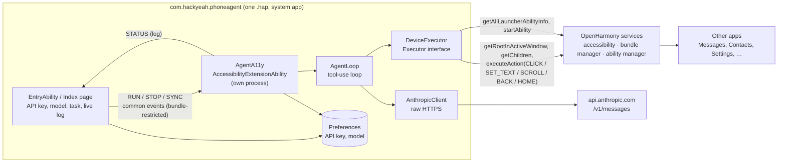
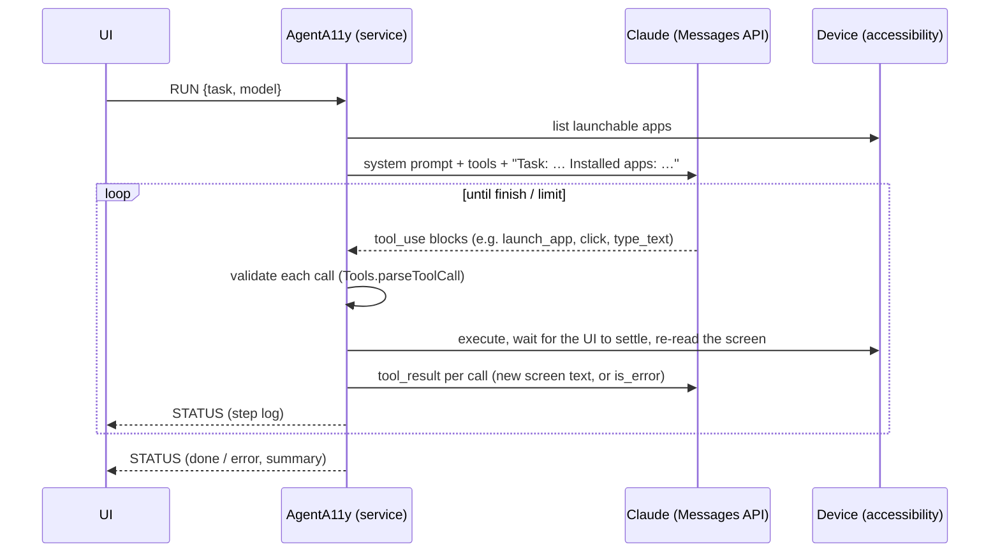

# Architecture

Phone Agent is a single `.hap` (bundle `com.hackyeah.phoneagent`) that turns a sentence like
*"napisz do babci SMS, że będę na jej urodzinach"* ("text grandma that I'll come to her birthday")
into taps and keystrokes in the phone's own apps. It is a general agent: it does not know any
app in advance. It reads whatever is on screen through the OpenHarmony accessibility framework
and lets a Claude model decide the next action.

## Components

| File | Role |
|---|---|
| `entry/src/main/ets/pages/Index.ets` | UI: API key, model picker, task, Run/Stop, live step log. Enables the accessibility service with `config.enableAbility`. |
| `entry/src/main/ets/a11y/AgentA11y.ets` | Accessibility extension. Hosts the agent loop and talks to the UI over common events. |
| `entry/src/main/ets/a11y/ScreenReader.ets` | Walks the accessibility tree of the active window. Click / set-text / scroll / global back and home. |
| `entry/src/main/ets/a11y/DeviceExecutor.ets` | Implements the agent's tools on the device: list and launch apps, read screen, tap, type, scroll, keys. |
| `entry/src/main/ets/agent/AgentLoop.ets` | Platform-independent loop: model call, tool-call validation, execution, results, limits. |
| `entry/src/main/ets/agent/Tools.ets` | Tool JSON schemas sent to the model, plus strict validation of the model's tool calls. |
| `entry/src/main/ets/agent/ScreenText.ets` | Turns accessibility nodes into the compact text the model reads. |
| `entry/src/main/ets/agent/Anthropic.ets` | Hand-written Messages API client: types, retries, error mapping, per-model options. |
| `entry/src/main/ets/agent/Prompt.ets` | System prompt. |
| `entry/src/main/ets/common/Bridge.ets` | Event names, payload types, publish/subscribe helpers. |
| `entry/src/main/ets/common/Settings.ets` | Preferences storage shared by the UI and the service. |

## Why the loop lives in the accessibility extension

The agent has to operate other apps, so they are in the foreground while it works, and the
Phone Agent UI is in the background. A backgrounded UIAbility can be frozen. An enabled
`AccessibilityExtensionAbility` instead stays connected in its own process for as long as the
service is on, and it is the component that is allowed to read other windows and act on them.
So the whole loop runs inside the extension, and the UI is only a remote control and log viewer.

The UI and the extension run in different processes and talk over **common events**:

* UI → service: `RUN` (task and model as JSON), `STOP`, `SYNC` (asks for the full log).
* Service → UI: `STATUS` (running flag plus new log entries, or the full log).

Both directions are restricted to this bundle. Events are published with
`bundleName: com.hackyeah.phoneagent`, and subscribers filter on
`publisherBundleName: com.hackyeah.phoneagent`. Other apps can't start tasks, inject commands
or read the log. Statuses carry `instance` and `version` stamps and are published one at a
time, so the UI never shows a stale "running" state. If the service doesn't acknowledge a
`RUN` within 5 s (for example because it is still connecting), the UI resets and asks the user
to try again.

The API key is never sent in an event. The UI writes it to app-private Preferences, and the
service reads it from there; it drops its Preferences cache first, because it runs in another
process.

## The agent loop

* **Tools**: `list_apps`, `launch_app(bundle_name)`, `read_screen`, `click(index)`,
  `type_text(index, text)`, `scroll(index, direction)`, `press_key(back|home)`,
  `finish(success, summary)`. Every action tool returns the *new* screen, which saves a
  round trip per step.
* **What the model sees**: each screen is a list with one element per line:
  `[7] Image (click) @332,349`, `[6] TextArea "Hello" hint="Text message" (click,edit,focused) @164,350`.
  Invisible, zero-size and empty layout-only nodes are dropped, and long texts are clipped. The
  list is capped at 150 elements. Indexes refer to the latest screen only.
* **No screenshots and no vision**: the accessibility tree is cheaper and more precise, and it
  works without screen-capture permissions.
* **History is append-only**: assistant turns, including `thinking` and `fallback` blocks, are
  sent back unchanged. This is required for the thinking models, and it keeps the prompt cache
  valid, using top-level `cache_control: ephemeral`.
* **Limits**: 25 model calls per task, a 2000-character cap on `type_text`, one nudge if the model
  answers without a tool, and the user can stop at any time.

## Robustness: when things go wrong

| Situation | Behaviour |
|---|---|
| Model sends an unknown tool, a missing or mistyped argument, a non-integer or out-of-range index, a bad enum, or oversized text | No action is executed. The model gets `tool_result` with `is_error: true` and a precise message (`Tools.parseToolCall`), and the loop continues. |
| Index valid in the schema but not on the current screen, element not editable, app not installed, or an action throws | The model gets `is_error` plus the current screen, so it can recover. |
| `stop_reason: refusal` | The task stops and the UI shows it. Tools from that turn are not executed. On Opus/Sonnet 5.5, `fallbacks: "default"` lets the API retry on a fallback model first. |
| `stop_reason: max_tokens` | The truncated turn is not executed, and the task stops with a message. |
| Model answers without a tool call | One nudge ("continue or call finish"), then the task stops. |
| HTTP 429 / 5xx / 529, network error or timeout | Up to 3 retries with exponential backoff that honours `retry-after`. Then a readable error is shown. |
| HTTP 401/403/404 | No retry. The UI shows "API key rejected" or "model not available". |
| Non-JSON or malformed response | A typed `invalid_response` error. |
| Service not connected yet | The UI's ack timeout resets the Run button. |

All of these paths are covered by the instrumented tests in `entry/src/ohosTest` (30 tests,
run on the emulator with `scripts/test.ps1`).

## Platform capabilities used

Phone Agent is an *improvement delivered as an installable app*: it adds a capability to the OS
(operate any app by natural language) without modifying the system image. It needs these
OpenHarmony system capabilities:

| Capability | API | Permission |
|---|---|---|
| Read other apps' UI, click, type, scroll, global back and home | `AccessibilityExtensionAbility`, `getRootInActiveWindow`, `AccessibilityElement.getChildren / executeAction` (API 20) | `ACCESSIBILITY_EXTENSION_ABILITY` |
| Turn its own accessibility service on from the app (no Settings detour) | `accessibility.config.enableAbility` | `WRITE_ACCESSIBILITY_CONFIG` |
| List launchable apps with labels | `launcherBundleManager.getAllLauncherAbilityInfo`, `bundleManager.getAbilityLabel` | `GET_BUNDLE_INFO_PRIVILEGED` |
| Launch apps from the background service | `AccessibilityExtensionContext.startAbility` | `START_ABILITIES_FROM_BACKGROUND` |
| Talk to the model | `@kit.NetworkKit` http | `INTERNET` |
| UI ↔ service IPC | `commonEventManager` (bundle-restricted) | — |

These are system APIs, available only to apps signed with privilege level `system_core`.
`scripts/sign.ps1` signs the app with the **public OpenHarmony test CA** that ships with every
OpenHarmony SDK (`OpenHarmony.p12`, plus `rootCA.cer` and `subCA.cer` from
`developtools_hapsigner`), using a provisioning profile with `apl: system_core` and
`app-feature: hos_system_app`. Stock OpenHarmony and Oniro images trust that CA, so the app
installs with plain `hdc install`: no root, no image changes. On commercial HarmonyOS the same
APIs are closed to third-party apps. That's why the project targets OpenHarmony / Oniro, where
an open platform lets an assistant like this exist at all.

Permissions not requested on purpose: no screen capture, no input injection, no SMS or
telephony permissions, no contacts access. The agent can only do what the user could do by hand
in the UI.

## Limitations

* The emulator has no SIM card, so Messages won't actually send (`canSendMessage=false` in its
  log). The agent fills in and presses Send, and the demo explains this.
* Icon-only buttons with no accessibility label are shown to the model as `Image (click) @x,y`.
  It infers them from position and context, which usually works, but not always.
* The agent is fully autonomous (a design decision for the challenge): there is no confirmation
  step before it presses Send.
* One task at a time, at most 25 steps, no memory between tasks.
